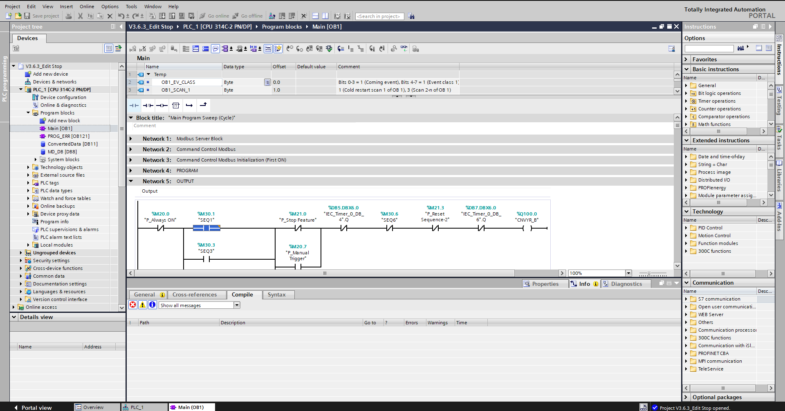
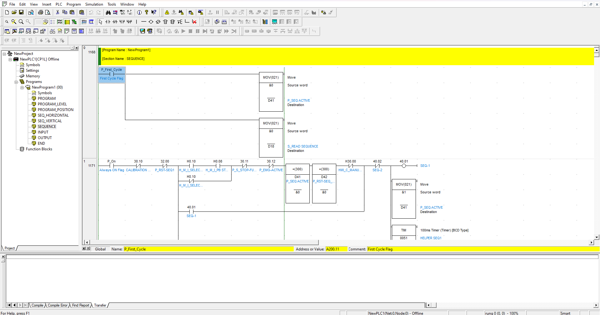

# Node-RED MPS SCADA Project

This repository contains the Node-RED MPS SCADA project, including maintenance guides, Standard Operating Procedures (SOPs), JSON code for Node-RED flows, and PLC programs.

**Indonesia Version** [here](README_ID.md)

## Table of Contents

- [Introduction](#introduction)
- [Maintenance Guide](#maintenance-guide)
- [Standard Operating Procedures (SOP)](#standard-operating-procedures-sop)
- [Node-RED JSON Code](#node-red-json-code)
- [PLC Programs](#plc-programs)
- [Visuals](#visuals)

## Introduction

This project aims to develop a SCADA system using Node-RED for monitoring and controlling a Modular Production System (MPS). The project includes integration of multiple PLCs using FINS UDP and Modbus TCP protocols.

  

  <b>Description:</b> The image above represents an overview of the system architecture, illustrating the integration and flow of data between different components in the SCADA system. The Omron CP1L-M30DR-A PLC uses the FINS UDP protocol, while the Siemens S7-300 PLC uses the Modbus TCP protocol. The PLCs are connected to a TP-Link WR840N router using Ethernet, which then sends the data to the MTU/PC. The Node-RED dashboard is used for monitoring, and InfluxDB is used for data storage. For more detailed information regarding this project, refer to the <a href="Document">Document</a> folder.

## Maintenance Guide

The maintenance guide provides detailed instructions on how to maintain the Node-RED MPS SCADA system.

### Regular Maintenance

1. **Check Node-RED Flows**: Ensure all flows are running without errors.
2. **Update Dependencies**: Regularly update Node-RED and installed nodes.
3. **Backup Flows**: Backup the current Node-RED flows.
4. **Inspect PLC Connections**: Verify all PLC connections are stable and functioning.

### Troubleshooting

1. **Node-RED Issues**: Refer to the Node-RED logs for error details.
2. **PLC Communication**: Check the PLC communication status and logs.
3. **Network Issues**: Ensure the network connectivity is stable and reliable.

## Standard Operating Procedures (SOP)

This section includes the SOPs for operating and managing the Node-RED MPS SCADA system.

### Starting the System

1. **Power On**: Turn on all PLCs and network devices.
2. **Launch Node-RED**: Start the Node-RED server.
3. **Load Flows**: Open the Node-RED dashboard and load the required flows.

### Shutting Down the System

1. **Stop Node-RED**: Gracefully stop the Node-RED server.
2. **Power Off**: Turn off all PLCs and network devices.

## Node-RED JSON Code

This section contains the JSON code for the Node-RED flows used in this project. The Node-RED flows are located in the [Node-RED](Node-RED) folder.

*_UPDATE!, the latest version of json file can be accesed [here](https://drive.google.com/drive/folders/10uxmqPGALChSED5ThXodnPyLMykk3cX8?usp=sharing)_

### Node-RED Modules in Use

The following Node-RED modules are used in this project:

1. **[node-red](https://nodered.org/docs/getting-started/local)**
   - **Description**: A visual tool for wiring the Internet of Things.

2. **[node-red-contrib-filesystem](https://flows.nodered.org/node/node-red-contrib-filesystem)**
   - **Description**: Nodes to work with the filesystem in Node-RED.

3. **[node-red-contrib-influxdb](https://flows.nodered.org/node/node-red-contrib-influxdb)**
   - **Description**: Node-RED nodes to save and query data from an InfluxDB time series database.

4. **[node-red-contrib-modbus](https://flows.nodered.org/node/node-red-contrib-modbus)**
   - **Description**: The all-in-one Modbus TCP and Serial contribution package for Node-RED.

5. **[node-red-contrib-omron-fins](https://flows.nodered.org/node/node-red-contrib-omron-fins)**
   - **Description**: Node-RED nodes to interact with Omron PLCs using the FINS protocol.

6. **[node-red-dashboard](https://flows.nodered.org/node/node-red-dashboard)**
   - **Description**: A set of dashboard nodes for Node-RED.

7. **[node-red-node-serialport](https://flows.nodered.org/node/node-red-node-serialport)**
   - **Description**: Node-RED nodes to talk to serial ports.

8. **[node-red-contrib-ui-led](https://flows.nodered.org/node/node-red-contrib-ui-led)**
   - **Description**: A Node-RED Dashboard user interface node that displays an LED status indicator.

9. **[node-red-contrib-ui-media](https://flows.nodered.org/node/node-red-contrib-ui-media)**
   - **Description**: A Node-RED Dashboard UI media node.

10. **[node-red-contrib-ui-svg](https://flows.nodered.org/node/node-red-contrib-ui-svg)**
    - **Description**: A Node-RED Dashboard UI SVG node.

## PLC Programs

This section contains the PLC programs used in this project. The PLC programs are provided in separate files within the `PLC Programs` directory.

### Separating Station (Siemens S7-300, TIA Portal V18)

- [Separating Station folder](PLC%20Programs/Separating%20Station)
*_UPDATE!, the latest version of PLC program can be accesed [here](https://drive.google.com/drive/folders/17O2cJEBwkU76QFwoHlvGs1rr3tJGL4iN?usp=sharing)_
  
  

### Storing Station (Omron CP1L-M30DR-A, CX-Programmer 9.7)

- [Storing Station folder](PLC%20Programs/Storing%20Station)
*_UPDATE!, the latest version of PLC program can be accesed [here](https://drive.google.com/drive/folders/10B0tcbbc91LAK33eiEgTlZiJ-Xo2hjZp?usp=sharing)_
  
  

## Visuals

- **Login Page**
  
  Description: The login page for accessing the SCADA system.

- **Account Dashboard**
  
  Description: This dashboard displays the account details and system status.

- **Separating Station**
  
  Description: The separating station dashboard in the SCADA system.

- **Separating Station 2**
  
  Description: Another view of the separating station dashboard.

- **Storing Station**
  
  Description: The storing station dashboard in the SCADA system.

- **Storing Station 2**
  
  Description: Another view of the storing station dashboard.

- **Alarm History**
  
  Description: This dashboard provides a history of all alarms generated by the system.
