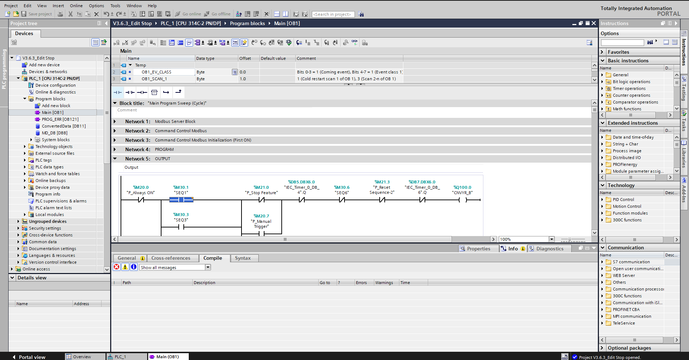

# Proyek SCADA Node-RED MPS

Repositori ini berisi proyek SCADA Node-RED MPS, termasuk panduan pemeliharaan, Prosedur Operasi Standar (SOP), kode JSON untuk aliran Node-RED, dan program PLC.

**Versi Inggris** [disini](README.md)

## Daftar Isi

- [Pendahuluan](#pendahuluan)
- [Panduan Pemeliharaan](#panduan-pemeliharaan)
- [Prosedur Operasi Standar (SOP)](#prosedur-operasi-standar-sop)
- [Kode JSON Node-RED](#kode-json-node-red)
- [Program PLC](#program-plc)
- [Visual](#visual)

## Pendahuluan

Proyek ini bertujuan untuk mengembangkan sistem SCADA menggunakan Node-RED untuk memantau dan mengendalikan Sistem Produksi Modular (MPS). Proyek ini mencakup integrasi beberapa PLC menggunakan protokol FINS UDP dan Modbus TCP.

  

  <b>Deskripsi:</b> Gambar di atas menggambarkan gambaran umum arsitektur sistem, menggambarkan integrasi dan aliran data antara berbagai komponen dalam sistem SCADA. PLC Omron CP1L-M30DR-A menggunakan protokol FINS UDP, sementara PLC Siemens S7-300 menggunakan protokol Modbus TCP. PLC terhubung ke router TP-Link WR840N menggunakan Ethernet, yang kemudian mengirimkan data ke MTU/PC. Dashboard Node-RED digunakan untuk pemantauan, dan InfluxDB digunakan untuk penyimpanan data. Untuk informasi lebih rinci tentang proyek ini, lihat folder <a href="Document">Dokumen</a>.

## Panduan Pemeliharaan

Panduan pemeliharaan menyediakan instruksi rinci tentang cara memelihara sistem SCADA Node-RED MPS.

### Pemeliharaan Reguler

1. **Periksa Aliran Node-RED**: Pastikan semua aliran berjalan tanpa kesalahan.
2. **Perbarui Dependensi**: Perbarui Node-RED dan node yang terinstal secara teratur.
3. **Cadangkan Aliran**: Cadangkan aliran Node-RED saat ini.
4. **Periksa Koneksi PLC**: Verifikasi semua koneksi PLC stabil dan berfungsi.

### Pemecahan Masalah

1. **Masalah Node-RED**: Lihat log Node-RED untuk detail kesalahan.
2. **Komunikasi PLC**: Periksa status komunikasi PLC dan log.
3. **Masalah Jaringan**: Pastikan konektivitas jaringan stabil dan andal.

## Prosedur Operasi Standar (SOP)

Bagian ini mencakup SOP untuk mengoperasikan dan mengelola sistem SCADA Node-RED MPS.

### Memulai Sistem

1. **Nyalakan**: Nyalakan semua PLC dan perangkat jaringan.
2. **Luncurkan Node-RED**: Mulai server Node-RED.
3. **Muat Aliran**: Buka dashboard Node-RED dan muat aliran yang diperlukan.

### Mematikan Sistem

1. **Hentikan Node-RED**: Hentikan server Node-RED dengan baik.
2. **Matikan**: Matikan semua PLC dan perangkat jaringan.

## Kode JSON Node-RED

Bagian ini berisi kode JSON untuk aliran Node-RED yang digunakan dalam proyek ini. Aliran Node-RED terletak di folder [Node-RED](Node-RED).

### Modul Node-RED yang Digunakan

Modul Node-RED berikut digunakan dalam proyek ini:

1. **[node-red](https://nodered.org/docs/getting-started/local)**
   - **Deskripsi**: Alat visual untuk menghubungkan Internet of Things.

2. **[node-red-contrib-filesystem](https://flows.nodered.org/node/node-red-contrib-filesystem)**
   - **Deskripsi**: Node untuk bekerja dengan sistem file di Node-RED.

3. **[node-red-contrib-influxdb](https://flows.nodered.org/node/node-red-contrib-influxdb)**
   - **Deskripsi**: Node Node-RED untuk menyimpan dan meng-query data dari database time series InfluxDB.

4. **[node-red-contrib-modbus](https://flows.nodered.org/node/node-red-contrib-modbus)**
   - **Deskripsi**: Paket kontribusi Modbus TCP dan Serial all-in-one untuk Node-RED.

5. **[node-red-contrib-omron-fins](https://flows.nodered.org/node/node-red-contrib-omron-fins)**
   - **Deskripsi**: Node Node-RED untuk berinteraksi dengan PLC Omron menggunakan protokol FINS.

6. **[node-red-dashboard](https://flows.nodered.org/node/node-red-dashboard)**
   - **Deskripsi**: Satu set node dashboard untuk Node-RED.

7. **[node-red-node-serialport](https://flows.nodered.org/node/node-red-node-serialport)**
   - **Deskripsi**: Node Node-RED untuk berbicara dengan port serial.

8. **[node-red-contrib-ui-led](https://flows.nodered.org/node/node-red-contrib-ui-led)**
   - **Deskripsi**: Node antarmuka pengguna dashboard Node-RED yang menampilkan indikator status LED.

9. **[node-red-contrib-ui-media](https://flows.nodered.org/node/node-red-contrib-ui-media)**
   - **Deskripsi**: Node media UI dashboard Node-RED.

10. **[node-red-contrib-ui-svg](https://flows.nodered.org/node/node-red-contrib-ui-svg)**
    - **Deskripsi**: Node SVG UI dashboard Node-RED.

## Program PLC

Bagian ini berisi program PLC yang digunakan dalam proyek ini. Program PLC disediakan dalam file terpisah di dalam direktori `PLC Programs`.

### Stasiun Pemisahan (Siemens S7-300, TIA Portal V18)

- [Folder Stasiun Pemisahan](PLC%20Programs/Separating%20Station)
  
  

### Stasiun Penyimpanan (Omron CP1L-M30DR-A, CX-Programmer 9.7)

- [Folder Stasiun Penyimpanan](PLC%20Programs/Storing%20Station)
  
  

## Visual

- **Halaman Login**
  
  Deskripsi: Halaman login untuk mengakses sistem SCADA.

- **Dashboard Akun**
  
  Deskripsi: Dashboard ini menampilkan detail akun dan status sistem.

- **Stasiun Pemisahan**
  
  Deskripsi: Dashboard stasiun pemisahan dalam sistem SCADA.

- **Stasiun Pemisahan 2**
  
  Deskripsi: Tampilan lain dari dashboard stasiun pemisahan.

- **Stasiun Penyimpanan**
  
  Deskripsi: Dashboard stasiun penyimpanan dalam sistem SCADA.

- **Stasiun Penyimpanan 2**
  
  Deskripsi: Tampilan lain dari dashboard stasiun penyimpanan.

- **Riwayat Alarm**
  
  Deskripsi: Dashboard ini menyediakan riwayat semua alarm yang dihasilkan oleh sistem.
